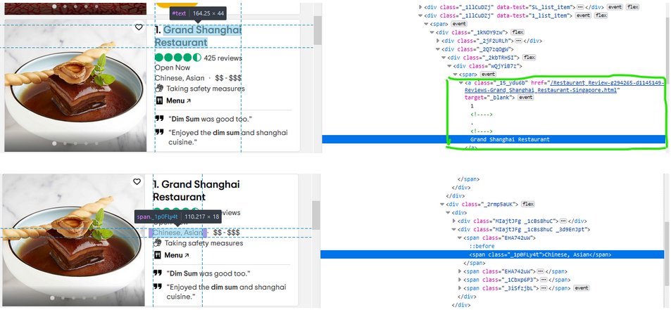
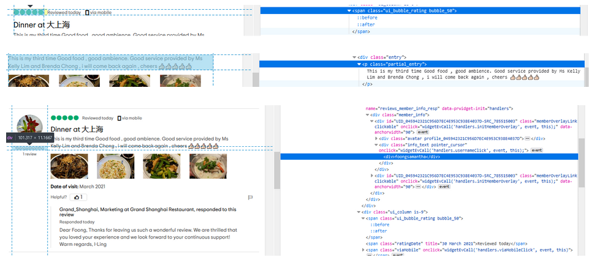

# CE/CZ4034 - Information Retrieval Project
*A simple search engine project done for the module CE/CZ4034 Information Retrieval in Nanyang Technological University AY2020-21 Semester 2*    
*A detailed report can be found in Report.pdf in the same repository*   
  
### Project Overview
- Introduction  
- Crawling
- Indexing and Querying  
- Classification  

### Presentation Video
Presentation Video Link: [CE/CZ4034 Information Retrieval Video Presentation](https://youtu.be/khasjY4OnBM)  
  
   
  
### Data Files
*Where all the initial data or genereated data files are stored*  
  
File Link: [Google Drive](https://drive.google.com/file/d/1HKwmMm2fs1s_ZW_1mitVDxPcfQdC6ZVY/view?usp=sharing)  

### Source Codes and Libraries 
*Where some of the libraries and miscellenous codes are stored*   
  
File Link: [Google Drive](https://drive.google.com/file/d/12CpsiGcW-tGmURcOvNDqoQDohBBbPY4B/view?usp=sharing)
  
### Saved Weights for the Classification Tasks
*A place where the saved weights of the models are stored*  
A README.txt is included in this folder to explain how and where the saved weights can be placed into the folder with the source codes.  
  
File Link: [Google Drive](https://drive.google.com/drive/folders/1zB_-cqWTy18zcnilWp6rmMattbmvGgzX?usp=sharing)

### Introduction
Singapore is a food paradise as acknowledged by many foreigners and locals. 
There are just so many food options to choose from and sometimes this might be troublesome for one to look for food options he/she wants to try on. 
As such, food review platforms provide information that update users with the comments and ratings made by other users on a particular stall or restaurant, 
hoping that the user will make an informed decision for their next meal.   
In this project, we have developed an information retrieval system for sentiment analysis on Singapore restaurant data crawled from trip-advisor. 
We first crawl our data using a python library named BeautifulSoup. Then, we use SOLR as the backend of the system to perform indexing and querying on the dataset. 
We then move on to information extraction to gain some insights on our crawled dataset. 
Afterwards, we use various deep learning approaches to do sentiment classification on the data based on a supervised learning approach and also various ways to enhance classification. 
Lastly, we implemented all of these using PySimpleGUI, a basic Graphical User Interface (GUI) to enhance user experiences.  
    
### Crawling 
we will be doing a two-level web crawling on tripadvisor’s Singapore restaurants landing page 
to get the customers’ comments, ratings, cuisines of the restaurants they have been to. 
The first level is to crawl the restaurant names, restaurant types (e.g Italian, European, Asian, Cafe etc.) 
and also the webpages that  lead to the details of the restaurants. The second level is to crawl the specific details of restaurants, 
such as the reviewer's name, ratings and comments given, based on the websites crawled in the first level.  

#### First Level Crawling
For the first level, we wrote a small test case first to crawl one set of data from the web to see if our crawling code works perfectly fine before we iterate it for multiple restaurants from multiple websites. After scrolling through a few entries, we realised that there are restaurants that were labelled as ‘sponsored’, which are repetitive as we proceed to crawl our data. Hence, we need to eliminate the ‘sponsored’ entries, which have the same tag ID as the targeted restaurant details we want to crawl, so that there will not be repeated entries. We observed that the restaurant labelled ‘sponsored’ appears after every 5 entries we want to crawl. Hence, we wrote a code to skip the crawl for every 6th instance of the data.
   
**Data we want to crawl and the sponsored tag**   
  
   
  
**Inspecting the elements we want to crawl**  
  
   
  
**Some entries crawled (saved in a .csv file)**  
  
  
   
#### Second Level Crawling
For the second level crawling, we will first load the .csv that was generated from the first level crawling. We then looked for the fields that we required and noted its id from the HTML tag. As such we crawled the reviewer’s name, rating and comment.  
  
We then make the program crawl iteratively through the 1013 restaurants based on the url generated from the first level crawling. We crawled 100 user data (reviewer’s name, rating and comment) from each restaurant. There may be some crawling issues along the way. As such the total number of records is less than 101300 entries.  
   
**Data we want to crawl**  
   
   
**Inspecting the elements we want to crawl (second level)**  
  
 
  
**Some entries crawled for second level (saved in a .csv file)**  
  
 