# CE/CZ4034 - Information Retrieval Project
*A simple search engine project done for the module CE/CZ4034 Information Retrieval in Nanyang Technological University AY2020-21 Semester 2*    
*A detailed report can be found in Report.pdf in the same repository*   
  
### Project Overview
- Introduction  
- Crawling
- Indexing and Querying  
- Classification  
- Enhancing Classification  

### Presentation Video
Presentation Video Link: [CE/CZ4034 Information Retrieval Video Presentation](https://youtu.be/khasjY4OnBM)  
  
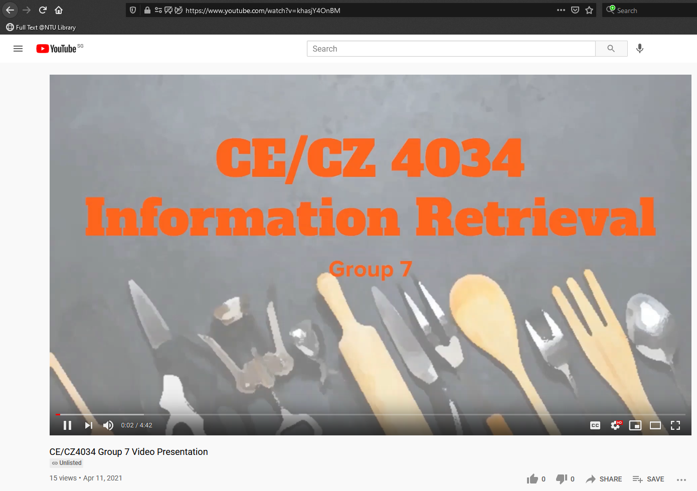   
  
### Data Files
*Where all the initial data or genereated data files are stored*  
  
File Link: [Google Drive](https://drive.google.com/file/d/1HKwmMm2fs1s_ZW_1mitVDxPcfQdC6ZVY/view?usp=sharing)  

### Source Codes and Libraries 
*Where some of the libraries and miscellenous codes are stored*   
  
File Link: [Google Drive](https://drive.google.com/file/d/12CpsiGcW-tGmURcOvNDqoQDohBBbPY4B/view?usp=sharing)
  
### Saved Weights for the Classification Tasks
*A place where the saved weights of the models are stored*  
A README.txt is included in this folder to explain how and where the saved weights can be placed into the folder with the source codes.  
  
File Link: [Google Drive](https://drive.google.com/drive/folders/1zB_-cqWTy18zcnilWp6rmMattbmvGgzX?usp=sharing)

### Introduction
Singapore is a food paradise as acknowledged by many foreigners and locals. 
There are just so many food options to choose from and sometimes this might be troublesome for one to look for food options he/she wants to try on. 
As such, food review platforms provide information that update users with the comments and ratings made by other users on a particular stall or restaurant, 
hoping that the user will make an informed decision for their next meal.   
In this project, we have developed an information retrieval system for sentiment analysis on Singapore restaurant data crawled from trip-advisor. 
We first crawl our data using a python library named BeautifulSoup. Then, we use SOLR as the backend of the system to perform indexing and querying on the dataset. 
We then move on to information extraction to gain some insights on our crawled dataset. 
Afterwards, we use various deep learning approaches to do sentiment classification on the data based on a supervised learning approach and also various ways to enhance classification. 
Lastly, we implemented all of these using PySimpleGUI, a basic Graphical User Interface (GUI) to enhance user experiences.  
    
### Crawling 
we will be doing a two-level web crawling on tripadvisor’s Singapore restaurants landing page 
to get the customers’ comments, ratings, cuisines of the restaurants they have been to. 
The first level is to crawl the restaurant names, restaurant types (e.g Italian, European, Asian, Cafe etc.) 
and also the webpages that  lead to the details of the restaurants. The second level is to crawl the specific details of restaurants, 
such as the reviewer's name, ratings and comments given, based on the websites crawled in the first level.  

#### First Level Crawling
For the first level, we wrote a small test case first to crawl one set of data from the web to see if our crawling code works perfectly fine before we 
iterate it for multiple restaurants from multiple websites. 
After scrolling through a few entries, we realised that there are restaurants that were labelled as ‘sponsored’, which are repetitive as we proceed to crawl our data. 
Hence, we need to eliminate the ‘sponsored’ entries, which have the same tag ID as the targeted restaurant details we want to crawl, so that there will not be repeated entries. 
We observed that the restaurant labelled ‘sponsored’ appears after every 5 entries we want to crawl. Hence, we wrote a code to skip the crawl for every 6th instance of the data.
   
**Data we want to crawl and the sponsored tag**   
  
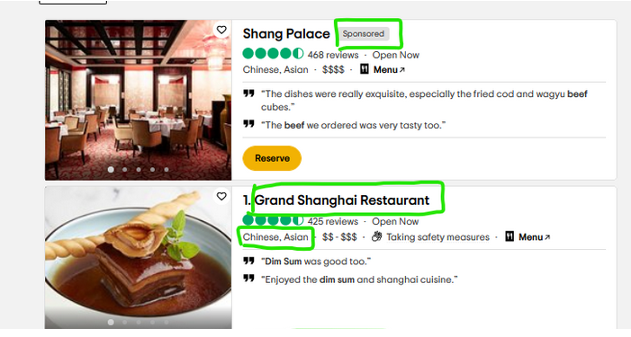   
  
**Inspecting the elements we want to crawl**  
  
   
  
**Some entries crawled (saved in a .csv file)**  
  
  
   
#### Second Level Crawling
For the second level crawling, we will first load the .csv that was generated from the first level crawling. 
We then looked for the fields that we required and noted its id from the HTML tag. As such we crawled the reviewer’s name, rating and comment.  
  
We then make the program crawl iteratively through the 1013 restaurants based on the url generated from the first level crawling.
We crawled 100 user data (reviewer’s name, rating and comment) from each restaurant. There may be some crawling issues along the way. As such the total number of records is less than 101300 entries.  
   
**Data we want to crawl**  
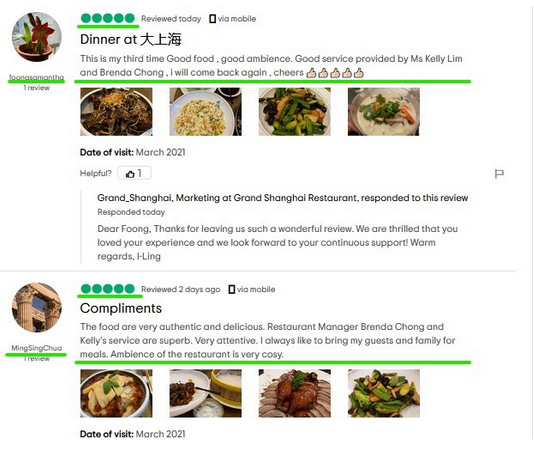   
   
**Inspecting the elements we want to crawl (second level)**  
  
 
  
**Some entries crawled for second level (saved in a .csv file)**  
  
  

### Indexing and Querying 
We have chosen Solr as our indexing system. Solr is an open source enterprise search platform which is written in Java. 
It provides full-text indexing and searching for structured and unstructured documents. 
REST-like API with the ability to adjust response format between XML, CSV or JSON makes it easy to integrate with other subsystems.  
   
Client apps can reach Solr by creating HTTP requests, then parsing the corresponding HTTP responses.   
    
A simple user interface was designed to illustrate the results when a query is made. PySimpleGUI is the Python package used to create our GUI. It is solely based on Tkinter.   
   
#### Introduction to Solr
Solr is a ready-to-use application, however some configurations are still required to provide better performances. 
In our application, we run the Solr server in standalone mode which means we only host on a single machine. 
We chose a schemaless implementation which Solr will automatically perform analysis on documents whenever the documentation is posted for indexing, 
necessary fields and field type will be created and managed by Solr. To prevent incorrect classification of data, one can predefine the fields with web admin interface or use schema API to configure schema.   
   
Schema include field and field type definitions. For each field, it can be configured in the field type and properties on how the data will be indexed. 
For the field type, it provides 3 components to configure which includes analyzer, tokenizer and list of filters which defines the text preprocessing methods. 
For the analyzer, it allows us to define different sets of rules to be applied for indexing or querying separately. Tokenizer defines a set of rules used to break input sequences into lexical units, 
for example Solr provides N-Gram Tokenizer to break input sequences into n-gram characters. After the input sequences are tokenized, 
a set of filters provide the rules for linguistic analysis which includes stopwords elimination, lemmatization, stemming and etc.   
  
With reference on field type declaration above, Solr web admin interface provides visual representation on how Solr performs pipelined text pre-processing based for both indexing and query.   
  
  
  
#### Solr Query
In Solr web admin interface, it provides a very comprehensive query tool for us to play with querying terms with different parameters to see the effect. 
The table below shows a set of parameters used in our application and their purpose 
  
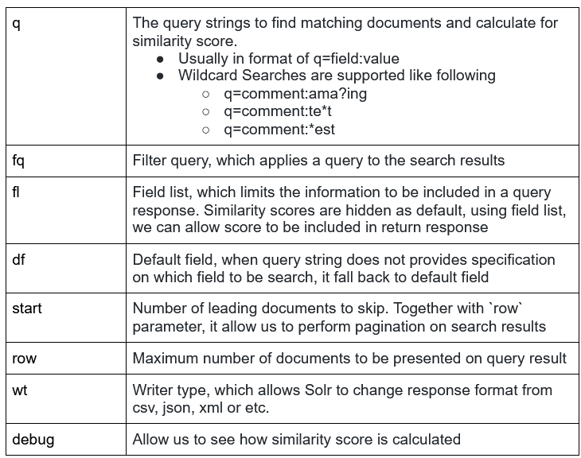   
   
#### Building a simple web interface for the search engine 
After importing the PySimpleGUI package, we create a series of widgets, which are called “Element” in PySimpleGUI, for example: Text, InputText and Button.   
   
All the elements created are put into a list called “layout”, after that, a “window” is created. It is the parent Element that contains all the other elements. 
A while loop is then created and the Window’s read() method is called to extract the events and values the user has set.   

A drop down list is created for the user to choose the function between “search”(select) and “spell check”(spell). By default, it is “search”. 
The selected term will be passed on to the request-handler(qt) in solr. The wt parameter in the query allows users to select an output format for the chosen API, 
for this assignment, JSON is selected as it is a more robust response format.A query is sent to solr by using http requests(by importing urllib) and parsing the JSON response(by importing simplejson) 
instead of using a client API.    

When using the application, a user can simply type the keywords in the search bar, and select the type of functions they want to perform, 
namely ‘search’ or ‘spell check’, where a user can use to check if there are any suggestions on the misspelled words.   
   
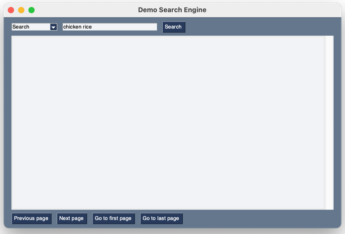  

For searching, after hitting the ‘search’ button, the results will be shown in the output box below. It will first show the number of results found in the database and the query time needed for the search. 
By default, it will show 10 results per page.  

For each result shown, it will contain the name of the restaurant, type of the restaurant, name of the reviewer, rating given, comment given, semantic predicted and tf/idf score.  

A user can then choose to navigate to the previous or next page, or jump to the first or last page based on their current page.  
  
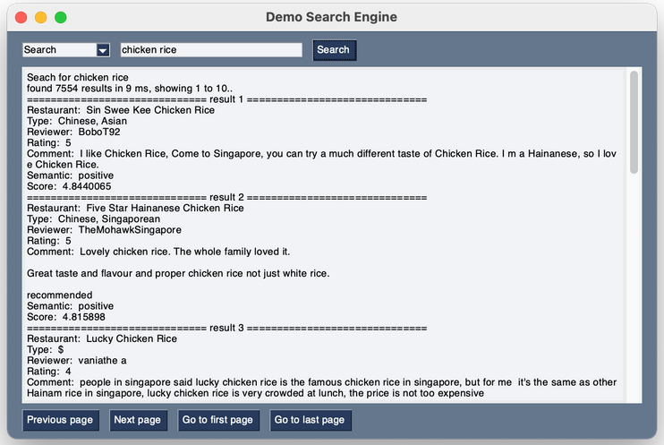  
   
For spell check usage, the user has to select ‘spell check’ from the drop down bar, type the word and click ‘search’. 
It will then print out the number of results found containing this keyword and its query time. Other than that, it will also print out the suggested word for correction if there exists one.   
  
   
   
### Classification
Sometimes, a particular user may be interested in looking at other users’ opinions at a particular restaurant or food in order to make an informed decision. 
As such, sentiment classification of the comments is essential so that the user can quickly decide whether the particular restaurant is of his/her choice based on the positive, neutral and negative comments.  
  
#### Tasks
- Information Extraction  
	- Text Summarization using Deep Learning  
	- Sentence Segmentation using POS Tagging  
- Data Pre-processing Steps for Classification  
- Evaluation Metrics  
- Inter-annotator Agreement  
  
#### Information Extraction
**Text Summarization using Deep Learning**  
Sometimes, we may encounter texts that are very lengthy and we only have a limited amount of time to skim through an article or a webpage. 
Likewise in our context, users may only be interested in the gist of the content when they seek for restaurant comments made by other users. 
As such, text summarization is needed in order to keep long descriptions short and sweet.  
   
Text Summarization is the technique for generating a concise and precise summary of large texts while focusing on the sections that convey useful information and retaining its overall meaning. 
There are two approaches towards Text Summarization, Extractive Summarization and Abstractive Summarization. Extractive Summarization is an approach that identifies the important sentences or 
phrases from the original text and extracts only those from the text. There will not be new sentences formed. Abstractive Summarization on the other hand generates new sentences from the original texts. 
The new sentences may not be present in the original text.   
   
In our context, we adopted the Abstractive Text Summarization method to summarize our crawled text using the Sequence-to-Sequence (Seq2Seq) model. 
We used the Abstractive Text Summarization method because it produces more human-like summaries as compared to Extractive Text Summarization. 
Seq2Seq consists of the Encoder-Decoder Architecture, which is used to solve the Seq2Seq problems where the input and the output sequences are of different lengths. 
Our Encoder-Decoder Architecture consists of 2 phases, the training phase and the inference phase.  
   
Here are the steps we adopted for the Text Summarization:  
  
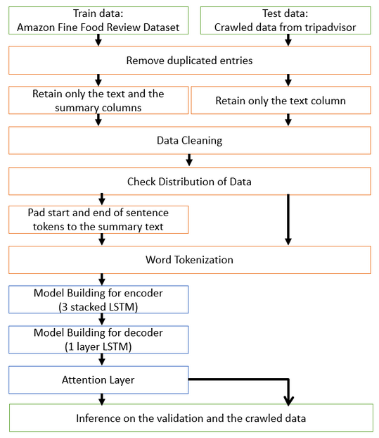  
  
Here are 5 samples of what our Text Summarizer has summarized on the test set: 
   
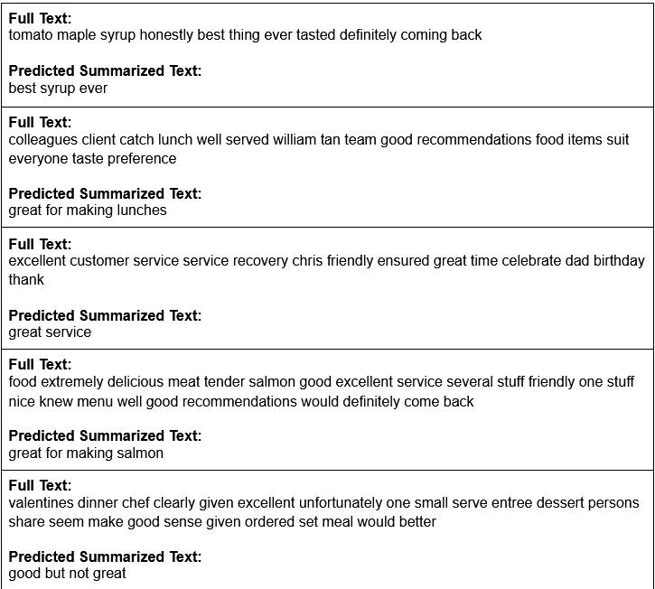  
  
**Sentence Segmentation using POS Tagging**  
Another technique for information extraction is sentence segmentation. Sentence segmentation is the problem of dividing a string of written language into its component sentences. 
Usually the sentences are segmented by punctuations. However, in our case, we are interested in extracting the noun, noun phrase, verb and verb phrase from the crawled data using Parts-of-Speech (POS) Tagging.    
    
Here are the steps we adopted for the Sentence Segmentation:   
  
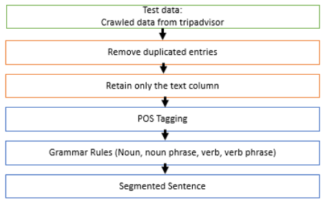  
	
Here are the 5 samples of segmented texts from the text entries:   
   
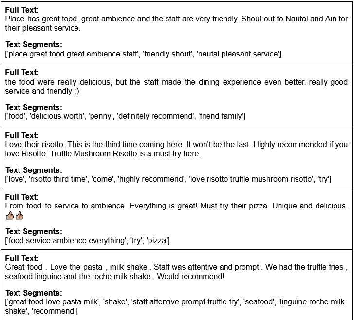  

#### Data Pre-processing Steps for Classification
We use LSTM, Bidirectional LSTM and BERT to train our classifier.   
  
Here are the data pre-processing steps for the classification task:   
   
  

#### Evaluation Metrics
**Evaluation on the validation data**  
  
We split our train data into training and validation sets with a ratio of 80:20 and start training the models on three different variations.   
  
  
**Evaluation on the validation data**  
  
  

**AUC-ROC plot**   
AUC-ROC plot of all the three models that are considered:   
  
  
   
#### Inter-annotator Agreement  
There may be some biases when it comes to rating a comment. Some comments that appear to be positive to one may appear neutral or negative to another and vice versa. 
Depending on how each user reads the comments and how he/she detects the indirectness in it such as sarcasm, there are bound to be disagreements in giving the rating.   
   
In this section, we want to find out how two annotators will annotate a 1000 entries of data sampled from the crawled data. 
The labels will be either positive (‘1’), neutral (‘0’), or negative (‘1’). 
We aimed to have an inter-annotator agreement of at least 80% as measured by the cohen-kappa score metric. 
Inter-annotator agreement is a measure of how well two annotators can make the same annotation decision for the three labels as described (‘1’, ‘0’ or ‘-1’). 
Cohen-kappa is a statistic that is used to measure the inter-annotator agreement.   
Cohen-kappa Score: 0.8350   
    
Confusion Matrix:   
  
    
   
### Enhancing Classification
   
#### Tasks
- Aspect-based Sentiment Analysis (ABSA)   
- Named Entity Recognition (NER)   
  
**Aspect-based Sentiment Analysis**   
ABSA is a text analysis technique that categorizes data by aspect and identifies the sentiment attributed to each one. 
In our context,  ABSA can be used to analyze the comments of the users by associating some targeted sentiments with different aspects of the food or the service. 
We can enhance classification here as there may be instances where there are two differing opinions from a single user on two different aspects, 
such as he/she may find the food quality is good (positive) but the customer service is bad (negative) as a single entry. 
We aim to note down the different aspects given by the users and its corresponding sentiment for that particular aspect.   
  
Steps Taken:  
  
   
Here are 2 examples of ABSA we have done:   
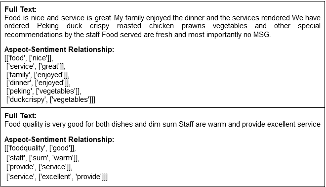   
   
**Named Entity Recognition**   
NER is a technique that seeks to detect and classify named entities in text into categories such as the name of a person, locations, time etc. 
In our context, we will build our NER system with SpaCy. We can enhance classification here because we are able to detect entities in the crawled corpus.   
   
Steps Taken:  
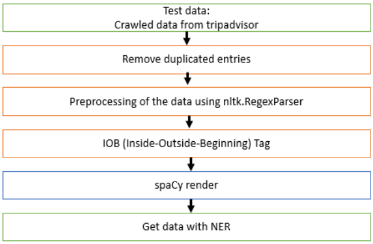  
   
Here are 2 examples of NER we have done:   
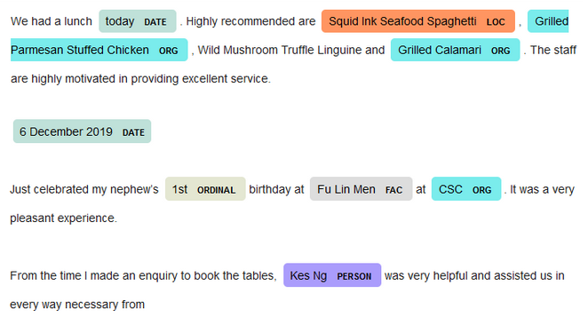   
   
### Conclusion
Having gone through the three stages in this assignment, crawling, indexing & querying and also classification, 
we aim to accurately classify the comments given by the users who reviewed a particular restaurant food. 
From our application’s perspective, we aim to impact other users to make informed decisions in selecting their choices of food for their next meal 
through our simple user interface backed by the indexing and querying system as well as the deep analysis in the classification of tasks.   